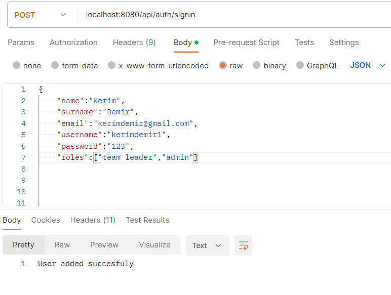
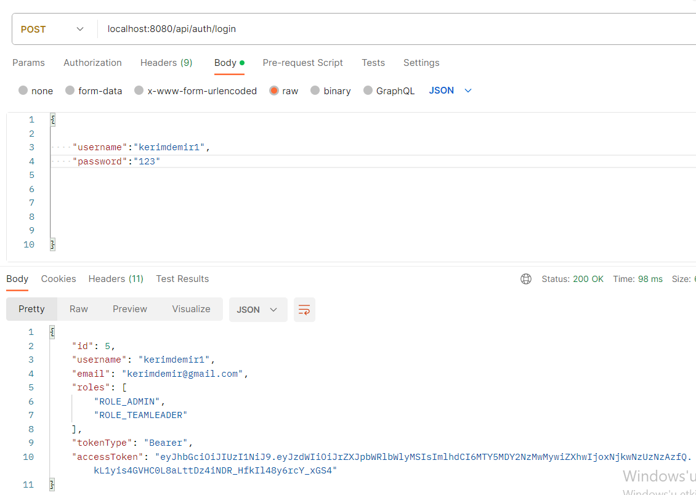

# Vehicle Fault Detector

Vehicle Fault Detector is an application for logging errors and faults for vehicles. With this application, vehicle defects and defect images can be saved.

## Technologies Used

- Spring Boot
- Spring Security(JWT Token)
- PostgreSQL
- Hibernate
    
## Features

- Role-based authentication
- User login/signup
- Vehicle defect save.
- Marking errors in pictures according to locations.


  
## Installation

 - Clone project repository
```java
git clone https://github.com/ahmettb/vehicle-fault-detector.git

```

- Edit application.properties

```java
spring.datasource.url=jdbc:postgresql://localhost:5432/yourdatabase
spring.datasource.username=yourusername
spring.datasource.password=yourpassword
spring.jpa.hibernate.ddl-auto=update
spring.jpa.properties.hibernate.jdbc.lob.non_contextual_creation= true
spring.jpa.show-sql=true
spring.datasource.driver-class-name=org.postgresql.Driver
logging.level.org.springframework.security=INFO
spring.jpa.properties.hibernate.dialect=org.hibernate.dialect.PostgreSQLDialect
spring.jackson.serialization.fail-on-empty-beans=false
cvqs.app.jwtSecret=yoursecret
cvqs.app.jwtExpirationMs=9990000
spring.servlet.multipart.enabled=true 
spring.servlet.multipart.maxFileSize=1000000KB
spring.servlet.multipart.maxRequestSize=1000000KB
```
-Run the project
  
## Screenshots

### Register Page


### Login Page


### Defect Point Image


